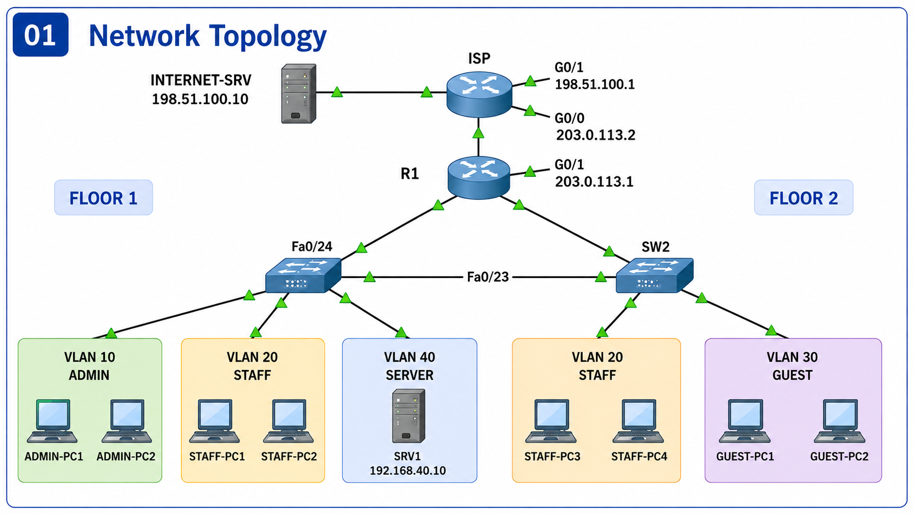

# Small Company Network

A secure multi-department company network designed and implemented using **Cisco Packet Tracer**.

The project demonstrates practical networking concepts including VLAN segmentation, 802.1Q trunking, Router-on-a-Stick, inter-VLAN routing, DHCP, DNS, ACL-based network security, NAT/PAT, WAN connectivity, and simulated Internet access.



---

## Project Overview

The goal of this project is to simulate the network infrastructure of a small company with multiple departments distributed across two floors.

The network is divided into four logical VLANs:

- Administration
- Staff
- Guest
- Server

Traffic between departments is controlled using **Extended Access Control Lists (ACLs)**.

The network also includes a simulated ISP and Internet server to demonstrate **WAN connectivity, default routing, and NAT/PAT**.

---

## Features

- VLAN Segmentation
- 802.1Q Trunking
- Router-on-a-Stick
- Inter-VLAN Routing
- DHCP
- Static Server Addressing
- DNS
- Internal HTTP Server
- Extended ACLs
- Network Access Control
- WAN Connectivity
- Default Route
- NAT
- PAT / NAT Overload
- Simulated ISP
- Simulated Internet Server
- Multi-floor Network Design

---

## Network Architecture

```text
                         INTERNET-SRV
                         198.51.100.10
                               |
                               |
                              ISP
                         198.51.100.1
                               |
                        203.0.113.2
                               |
                        203.0.113.1
                              R1
                               |
                       802.1Q TRUNK
                               |
                              SW1
              _________________|_________________
             |                 |                 |
          VLAN 10           VLAN 20           VLAN 40
           ADMIN             STAFF             SERVER
             |                 |                 |
         ADMIN-PC1         STAFF-PC1            SRV1
         ADMIN-PC2         STAFF-PC2
                               |
                         802.1Q TRUNK
                               |
                              SW2
                         ______|______
                        |             |
                     VLAN 20       VLAN 30
                      STAFF          GUEST
                        |             |
                   STAFF-PC3     GUEST-PC1
                   STAFF-PC4     GUEST-PC2
```

---

## VLAN Configuration

| VLAN | Name | Network | Gateway |
|---|---|---|---|
| 10 | ADMIN | `192.168.10.0/24` | `192.168.10.1` |
| 20 | STAFF | `192.168.20.0/24` | `192.168.20.1` |
| 30 | GUEST | `192.168.30.0/24` | `192.168.30.1` |
| 40 | SERVER | `192.168.40.0/24` | `192.168.40.1` |

---

## IP Addressing

### Internal Networks

| Device / Network | Address |
|---|---|
| ADMIN Network | `192.168.10.0/24` |
| STAFF Network | `192.168.20.0/24` |
| GUEST Network | `192.168.30.0/24` |
| SERVER Network | `192.168.40.0/24` |
| Internal Server | `192.168.40.10` |

### WAN

| Device | Interface | Address |
|---|---|---|
| R1 | G0/1 | `203.0.113.1/30` |
| ISP | G0/0 | `203.0.113.2/30` |

### Simulated Internet

| Device | Address |
|---|---|
| ISP Gateway | `198.51.100.1/24` |
| Internet Server | `198.51.100.10/24` |

---

## Router-on-a-Stick

R1 performs inter-VLAN routing using subinterfaces.

```text
G0/0.10 → VLAN 10 → 192.168.10.1
G0/0.20 → VLAN 20 → 192.168.20.1
G0/0.30 → VLAN 30 → 192.168.30.1
G0/0.40 → VLAN 40 → 192.168.40.1
```

Each subinterface uses IEEE 802.1Q VLAN tagging.

Example:

```cisco
interface GigabitEthernet0/0.10
 encapsulation dot1Q 10
 ip address 192.168.10.1 255.255.255.0
```

---

## Switch Port Assignment

### SW1

| Port | Device | VLAN |
|---|---|---|
| Fa0/1 | ADMIN-PC1 | 10 |
| Fa0/2 | ADMIN-PC2 | 10 |
| Fa0/3 | STAFF-PC1 | 20 |
| Fa0/4 | STAFF-PC2 | 20 |
| Fa0/5 | SRV1 | 40 |
| Fa0/23 | SW2 | Trunk |
| Fa0/24 | R1 | Trunk |

### SW2

| Port | Device | VLAN |
|---|---|---|
| Fa0/1 | STAFF-PC3 | 20 |
| Fa0/2 | STAFF-PC4 | 20 |
| Fa0/3 | GUEST-PC1 | 30 |
| Fa0/4 | GUEST-PC2 | 30 |
| Fa0/24 | SW1 | Trunk |

---

## Trunk Configuration

### SW1 ↔ SW2

The trunk between SW1 and SW2 carries:

```text
VLAN 20
VLAN 30
```

### SW1 ↔ R1

The trunk between SW1 and R1 carries:

```text
VLAN 10
VLAN 20
VLAN 30
VLAN 40
```

Example:

```cisco
interface FastEthernet0/24
 switchport mode trunk
 switchport trunk allowed vlan 10,20,30,40
```

---

## DHCP

R1 acts as the DHCP server for:

- ADMIN
- STAFF
- GUEST

The first addresses in each subnet are reserved for gateways, infrastructure, and future static devices.

Example:

```cisco
ip dhcp excluded-address 192.168.10.1 192.168.10.20

ip dhcp pool ADMIN_POOL
 network 192.168.10.0 255.255.255.0
 default-router 192.168.10.1
 dns-server 192.168.40.10
```

The internal server uses a static address:

```text
IP Address:      192.168.40.10
Subnet Mask:     255.255.255.0
Default Gateway: 192.168.40.1
```

---

## DNS

The internal DNS service runs on:

```text
192.168.40.10
```

Configured DNS records include:

| Name | Address |
|---|---|
| `company.local` | `192.168.40.10` |
| `www.company.local` | `192.168.40.10` |
| `server.company.local` | `192.168.40.10` |

Example:

```text
ping server.company.local
```

resolves to:

```text
192.168.40.10
```

---

## Internal Web Server

The internal HTTP server runs on:

```text
192.168.40.10
```

Internal users with permission can access:

```text
http://www.company.local
```

The server hosts a basic company network status page.

---

## Security Policy

Network access is controlled using Extended ACLs.

| Source | ADMIN | STAFF | SERVER | Internet |
|---|---:|---:|---:|---:|
| ADMIN | — | ✅ | ✅ | ✅ |
| STAFF | ❌ | — | ✅ | ✅ |
| GUEST | ❌ | ❌ | ❌ | ✅ |

Additional Guest policy:

```text
GUEST → Internal DNS : Allowed
GUEST → Internal HTTP: Blocked
GUEST → Server ICMP  : Blocked
```

---

## ADMIN Policy

ADMIN has the highest level of access.

```text
ADMIN → STAFF     ALLOWED
ADMIN → GUEST     ALLOWED
ADMIN → SERVER    ALLOWED
ADMIN → INTERNET  ALLOWED
```

Return ICMP traffic is permitted so ADMIN can successfully test managed devices.

---

## STAFF Policy

STAFF can access company server resources and the Internet but cannot initiate connections toward ADMIN or GUEST.

```text
STAFF → ADMIN     BLOCKED
STAFF → GUEST     BLOCKED
STAFF → SERVER    ALLOWED
STAFF → INTERNET  ALLOWED
```

---

## GUEST Policy

Guest devices are isolated from company internal resources.

```text
GUEST → ADMIN     BLOCKED
GUEST → STAFF     BLOCKED
GUEST → SERVER    BLOCKED
GUEST → INTERNET  ALLOWED
```

DNS queries to the internal DNS server are permitted:

```text
UDP 53 → ALLOWED
TCP 53 → ALLOWED
```

This allows hostname resolution without giving Guest users direct access to the internal server.

---

## ACL Example

```cisco
ip access-list extended GUEST_IN

 permit udp any eq bootpc any eq bootps

 permit udp 192.168.30.0 0.0.0.255 host 192.168.40.10 eq domain
 permit tcp 192.168.30.0 0.0.0.255 host 192.168.40.10 eq domain

 permit icmp 192.168.30.0 0.0.0.255 192.168.10.0 0.0.0.255 echo-reply

 deny ip 192.168.30.0 0.0.0.255 192.168.10.0 0.0.0.255
 deny ip 192.168.30.0 0.0.0.255 192.168.20.0 0.0.0.255
 deny ip 192.168.30.0 0.0.0.255 192.168.40.0 0.0.0.255

 permit ip 192.168.30.0 0.0.0.255 any
```

The ACL is applied inbound on:

```cisco
interface GigabitEthernet0/0.30
 ip access-group GUEST_IN in
```

---

## WAN Connectivity

R1 connects to a simulated ISP through:

```text
R1 G0/1
203.0.113.1/30
```

ISP:

```text
ISP G0/0
203.0.113.2/30
```

R1 uses the ISP as its default gateway:

```cisco
ip route 0.0.0.0 0.0.0.0 203.0.113.2
```

---

## NAT / PAT

Private company networks use PAT to share the WAN address:

```text
203.0.113.1
```

NAT inside interfaces:

```text
G0/0.10
G0/0.20
G0/0.30
G0/0.40
```

NAT outside interface:

```text
G0/1
```

Configuration:

```cisco
access-list 1 permit 192.168.10.0 0.0.0.255
access-list 1 permit 192.168.20.0 0.0.0.255
access-list 1 permit 192.168.30.0 0.0.0.255
access-list 1 permit 192.168.40.0 0.0.0.255

ip nat inside source list 1 interface GigabitEthernet0/1 overload
```

---

## Simulated Internet

The lab includes an external server:

```text
Internet Server
198.51.100.10
```

All permitted departments can reach the external server through:

```text
Client
  ↓
VLAN
  ↓
R1
  ↓
NAT/PAT
  ↓
ISP
  ↓
Internet Server
```

---

## Testing Results

| Test | Result |
|---|---|
| VLAN Segmentation | PASS |
| 802.1Q Trunking | PASS |
| Router-on-a-Stick | PASS |
| Inter-VLAN Routing | PASS |
| DHCP | PASS |
| DNS Resolution | PASS |
| Internal HTTP | PASS |
| ADMIN → STAFF | PASS |
| ADMIN → GUEST | PASS |
| ADMIN → SERVER | PASS |
| STAFF → ADMIN Block | PASS |
| STAFF → GUEST Block | PASS |
| STAFF → SERVER | PASS |
| GUEST → ADMIN Block | PASS |
| GUEST → STAFF Block | PASS |
| GUEST → SERVER Block | PASS |
| GUEST → DNS | PASS |
| WAN Connectivity | PASS |
| Default Routing | PASS |
| NAT/PAT | PASS |
| Internet Access | PASS |

---

## Useful Verification Commands

### Router

```cisco
show ip interface brief
show ip route
show ip dhcp binding
show access-lists
show ip nat translations
show ip nat statistics
```

### Switches

```cisco
show vlan brief
show interfaces trunk
show interfaces status
```

---

## Screenshots

Project screenshots are stored in:

```text
Screenshots/
```

Recommended evidence:

```text
01-topology.png
02-vlans-sw1.png
03-trunks.png
04-router-interfaces.png
05-dhcp-bindings.png
06-dns-test.png
07-http-server.png
08-acl-security.png
09-internet-test.png
10-nat-translations.png
```

---

## Project Structure

```text
Small-Company-Network/
│
├── Packet-Tracer/
│   └── Small-Company-Network.pkt
│
├── Configurations/
│   ├── R1-config.txt
│   ├── ISP-config.txt
│   ├── SW1-config.txt
│   └── SW2-config.txt
│
├── Documentation/
│   ├── Network-Topology.md
│   ├── IP-Addressing.md
│   ├── VLANs.md
│   ├── Security-Policy.md
│   └── Testing.md
│
├── Screenshots/
│   ├── 01-topology.png
│   ├── 02-vlans-sw1.png
│   ├── 03-trunks.png
│   ├── 04-router-interfaces.png
│   ├── 05-dhcp-bindings.png
│   ├── 06-dns-test.png
│   ├── 07-http-server.png
│   ├── 08-acl-security.png
│   ├── 09-internet-test.png
│   └── 10-nat-translations.png
│
├── README.md
├── LICENSE
└── .gitignore
```

---

## How to Run

1. Install Cisco Packet Tracer.
2. Clone or download this repository.
3. Open:

```text
Packet-Tracer/Small-Company-Network.pkt
```

4. Wait for all network links to become operational.
5. Use the PCs' Command Prompt or Web Browser to run connectivity tests.
6. Use the router and switch CLI to inspect VLANs, routing, ACLs, DHCP, and NAT.

---

## Technologies & Concepts

- Cisco Packet Tracer
- Cisco IOS
- IPv4
- Subnetting
- VLAN
- IEEE 802.1Q
- Router-on-a-Stick
- Inter-VLAN Routing
- DHCP
- DNS
- HTTP
- ACL
- ICMP
- Static Routing
- Default Routing
- NAT
- PAT
- WAN
- Network Security
- Network Troubleshooting

---

## Project Status

**Completed**

All major network services, routing features, security policies, and simulated Internet connectivity have been configured and tested successfully.
